# **Traffic Sign Recognition**
#### Prabath Peirs (peiris.prabath@gmail.com)
#### Udacity, Traffic Sign Classifier Project
---
# Dataset Summary

German Traffic Sign Dataset contain more than 50,000 images with over 40 classes. You can download this data set from [here.](http://benchmark.ini.rub.de/?section=gtsrb&subsection=dataset)


|  Dataset Summary          |                                     |
|:---------------------:|:---------------------------------------------:|
| Number of Training Examples     | 34799 |
| Number of Testing Examples      | 12630 |
| Number of Classes               | 43    |
| Image data shape                | 32x32x3 |


## Exploratory Visualization

- Sample set of images
You can find the mapping from Class Ids to Sign Names [here.](../signnames.csv)
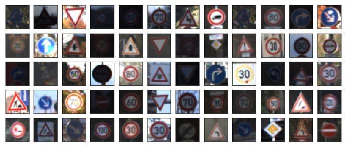

- Training/Test and Validation sets are splits as follows

|  Data Visualization          |                                     |
|:---------------------:|:---------------------------------------------:|
| 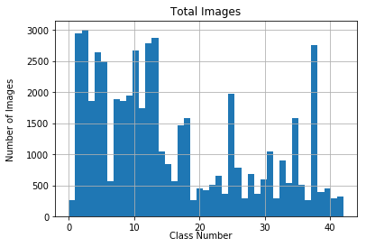     |  |
|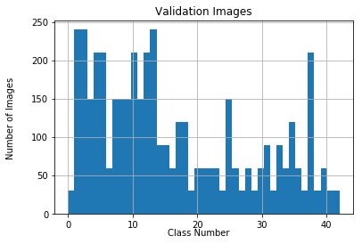|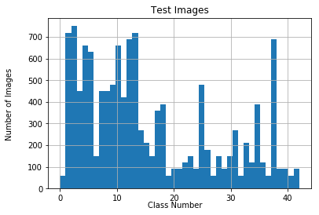|

# Design and Test a Model Architecture

## Preprocessing

During the data pre-processing I have applies the following steps

- Convert images to gray scale using `tf.image.rgb_to_grayscale` method
- Normalize each gray scale image using `(pixel - 128)/ 128`

After convert to gray scale and normalized, images are looks as follows,
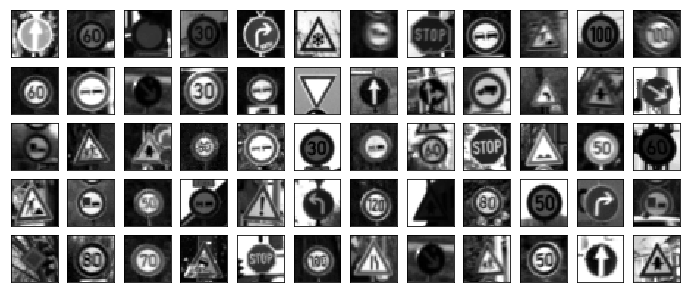


## Model Architecture

The model architecture has been used in this project as follows,

- Layer 1 (Convolutional Layer)
    - input  : 32x32x3
    - output : 28x28x6
    - activation : relu
    - biase : None
    - dropouts : 30%
    - padding : VALID

- Layer 2 (Max Pooling Layer)
	- input : 28x28x6
	- output : 14x14x6
	- padding : VALID

- Layer 3 (Convolutional Layer)
    - input  : 14x14x6s
    - output : 10x10x16
    - activation : relu
    - biase : None
    - dropouts : 30%
    - padding : VALID

- Layer 4 (Max Pooling Layer)
	- input : 10x10x16
	- output : 5x5x16
	- padding : VALID

- Layer 5 (Flatten Layer)
	- input : 5x5x16
	- output : 400

- Layer 6 (Fully Connected Layer)
	- input : 400
	- output : 120
	- biase : None
	- activation : relu
	- dropouts : 30%

- Layer 7 (Fully connected layer)
	- input : 120
	- output : 84
	- biase : None
	- activation : relu
	- dropouts : 30%

- Layer 8 (Fully connected layer)
	- input : 84
	- output : 43
	- biase : None


The network architecture is a modification to what we have used in the LeNet project. I have introduced dropouts as an additional step. Other parameters are chosen primarily by trial and error.

## Model Training

For the model training, I have used the following parameters.

- optimizer :  AdamOptimizer (recomended in the lectures)
- batch size : 128
- number of epochs : 20
- dropouts : 30% (keep 70%)
- learning rate : 0.0008
- lables : One hot encoded


## Solution Approach

The final model accuracy reaches above 0.93 for the validation data. This solution has been found by starting from the LeNet project model architecture and modifying it by trial and error basis. For example, I had seen occilation of the accuracy when I was using higher learning rates. That was obvious to see the optimizer is taking longer steps where it was mising the minimum.

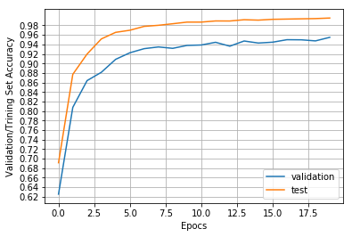


# Test the Model on New Images

## Acquiring New Images

With a simple google search, I have acquired the following images. These images are already being scaled to 32x32x3 pixs.

|    image 1         |  image 2 | image 3 | image 4 | image 5 |
|:---------------------:|:------:|:------:|:------:|:------:|
| 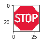 | 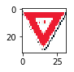 | 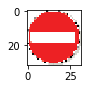 | 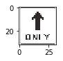 | 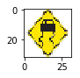 |


## Performance on New Images

- Image 1
	- Real sign name: - Stop
	- Predicted sign name: - Speed limit (30km/h)
- Image 2
	- Real sign name: - Yield
	- Predicted sign name:  - Yield
- Image 3
	- Real sign name: - No entry
	- Predicted sign name:  - No entry
- Image 4
	- Real sign name: - Ahead only
	- Predicted sign name:  - Right-of-way at the next intersection
- Image 5
	- Real sign name: - Slippery road
	- Predicted sign name:  - Stop


Test accuracy of the model is 0.942, and the accuracy of the acquired images is 0.5. I have intentionally pick images that are not that clear and perhaps more difficult to classify. As you can observe the accuracy of the data is satisfactory; however, it is clear that this model needs more fine tuning to get higher accuracy.


## Model Certainty - Softmax Probabilities

```
TopKV2(values=array([[  1.00000000e+00,   0.00000000e+00,   0.00000000e+00,
          0.00000000e+00,   0.00000000e+00],
       [  1.00000000e+00,   0.00000000e+00,   0.00000000e+00,
          0.00000000e+00,   0.00000000e+00],
       [  1.00000000e+00,   0.00000000e+00,   0.00000000e+00,
          0.00000000e+00,   0.00000000e+00],
       [  1.00000000e+00,   0.00000000e+00,   0.00000000e+00,
          0.00000000e+00,   0.00000000e+00],
       [  1.00000000e+00,   5.17204713e-15,   0.00000000e+00,
          0.00000000e+00,   0.00000000e+00]], dtype=float32), indices=array([[ 1,  0,  2,  3,  4],
       [13,  0,  1,  2,  3],
       [17,  0,  1,  2,  3],
       [11,  0,  1,  2,  3],
       [14, 40,  0,  1,  2]], dtype=int32))
```


# Recomentation to improve this design

It is clear that I need to make this model more accurate and get higher accuracy for random images. The following steps may help to improve the design,

- I am planning to test different model architectures
- Check many other hyperparameter values
- Augment the training dataset
- Use regularization technique to avoid the overfitting
- Make the dropout parameter individual to the layer instead of using one for all the laters
